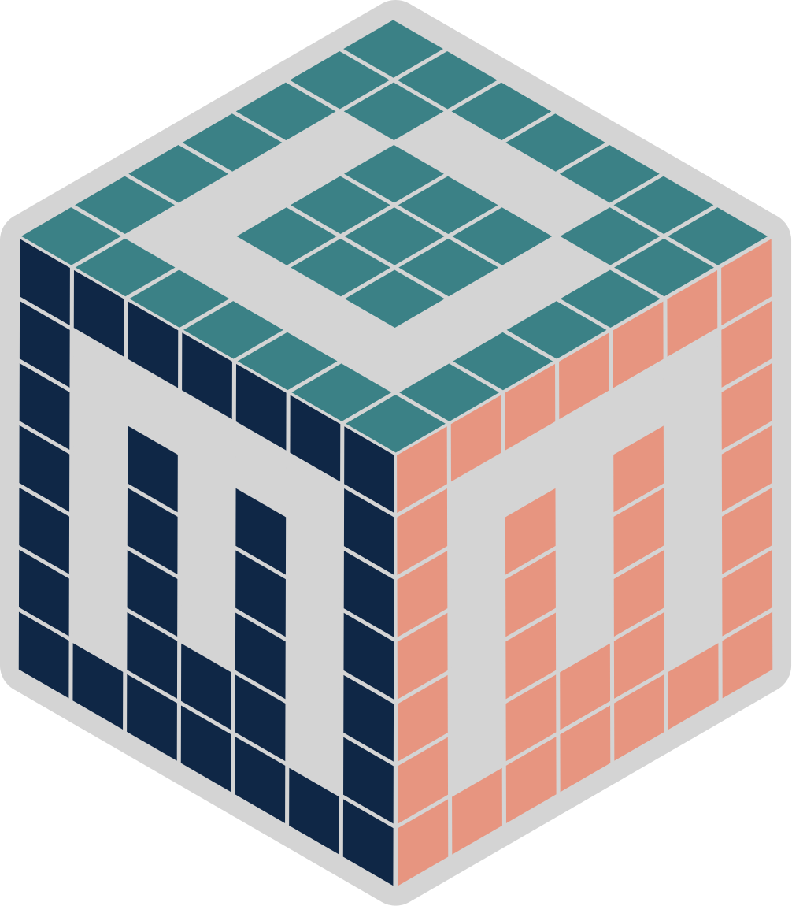
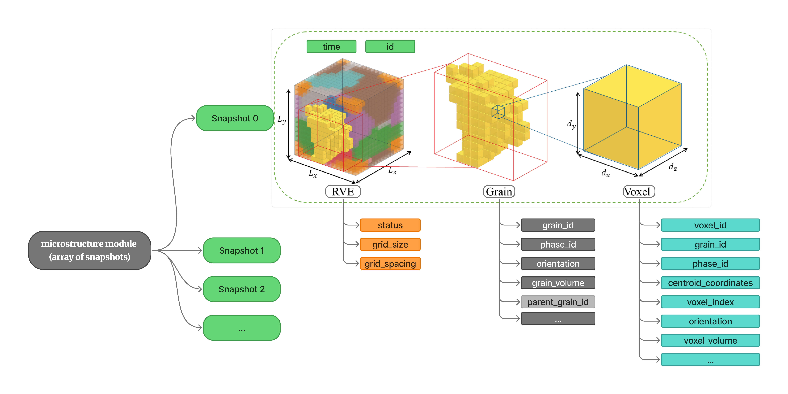

<p align="center">
  
</p>

<h2 align="center">
MiMeDat – Microstructure Module
</h2>

<p align="center">
  <em>A modular JSON schema for representing the spatial and temporal evolution of microstructures in computational materials-science workflows.</em>
</p>

<p align="center">
  <strong>Part of the MiMeDat ecosystem.</strong><br>
  For the complete modular metadata schema, see the main
  <a href="https://github.com/YousefRezek/MiMeDat-Schema">MiMeDat Schema</a> repository.
</p>

---

# Overview

The **MiMeDat Microstructure Module** defines how microstructural states are represented inside the MiMeDat schema.

It focuses on the microstructure as an evolving, structured data object rather than as a single static input or solver-specific output. The module provides a schema-level representation for storing, validating, exchanging, and reusing microstructure information independently of the software used to generate it.

The current implementation focuses on structured-grid, voxelized microstructures and supports:

- time-ordered microstructure snapshots,
- representative volume element/grid information,
- grain-level descriptors,
- voxel-level descriptors,
- field quantities associated with evolving microstructural states.

---

# Architecture

The Microstructure Module represents microstructure evolution as an ordered array of snapshots. Each snapshot describes one microstructural state at a specific time or workflow step.

<p align="center">
  
</p>

The module follows the hierarchy:

```text
Microstructure Module
│
├── Snapshot
│   ├── id
│   ├── time
│   ├── grid
│   ├── grains
│   └── voxels
│
├── Snapshot
│   └── ...
│
└── ...
```

This structure allows the module to capture both the spatial organization of one microstructure state and its temporal evolution across multiple snapshots.

---

# Microstructure Data Model

Each snapshot is organized into three complementary levels.

| Level | Description |
|---|---|
| **Grid** | Describes the spatial frame of the snapshot, including grid status, physical size, and spacing. |
| **Grains** | Stores grain-wise information such as grain identifiers, phase identifiers, orientations, grain volumes, and optional parent-grain relationships. |
| **Voxels** | Stores voxel-wise information such as voxel identifiers, grain and phase membership, centroid coordinates, voxel indices, orientations, voxel volumes, and optional field quantities. |

Together, these levels make the microstructure readable at both the grain-resolved and voxel-resolved scale.

---

# JSON Schema

The Microstructure Module schema is provided in this repository as:

```text
Microstructure_Module.json
```

The schema defines:

- required and optional fields,
- object hierarchy,
- accepted data types,
- snapshot structure,
- grid, grain, and voxel descriptors,
- validation rules for schema-conformant microstructure objects.

The schema follows the JSON Schema standard and can be checked using any compatible JSON Schema validator.

---

# Examples

Example data objects will be added to demonstrate how the Microstructure Module can be used in practice.

Planned examples include:

| Example | Description |
|---|---|
| **Initial microstructure** | A single undeformed structured-grid microstructure. |
| **Microstructure evolution** | A multi-snapshot object representing temporal evolution. |
| **Grain-resolved example** | A snapshot emphasizing grain identifiers, phases, orientations, and grain volumes. |
| **Voxel-resolved example** | A snapshot emphasizing voxel IDs, centroid coordinates, grain membership, phase membership, and field data. |

---

# Resources

## Schema Resources

**Main MiMeDat schema**

```text
microstructure_sensitive_mechanical_metadata_schema.json
```

**Microstructure Module schema**

```text
Microstructure_Module.json
```

Main MiMeDat Schema repository:

```text
https://github.com/YousefRezek/MiMeDat-Schema
```

Microstructure Module repository:

```text
https://github.com/YousefRezek/MiMeDat-Microstructure-Module
```

---

## Related Publication

**Yousef Rezek**, **Ronak Shoghi**, **Alexander Hartmaier**

**MiMeDat: A Modular, Workflow-Centric, Code-Agnostic Schema for FAIR Data Objects Capturing Microstructure Evolution and Mechanical Data in Multi-Tool Processing–Structure–Properties Workflows**

---

## Development Status

The MiMeDat schema is under active development. The schema, documentation, and accompanying publication may evolve as the project progresses.

---

## Authors

**Yousef Rezek**  
**Alexander Hartmaier**

Institute for Computational Materials Engineering (ICAMS)  
Ruhr University Bochum  
Germany

---

## Contact

**Yousef Rezek**  
📧 yousef.rezek@rub.de

---

# License

This repository is distributed under the license provided with the project.
